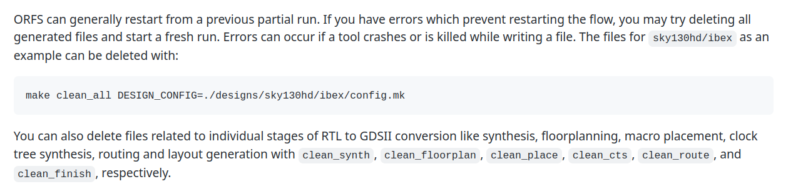
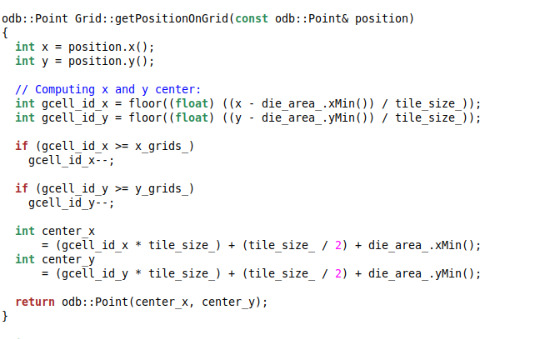
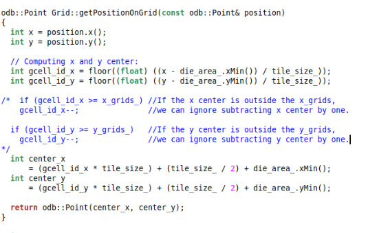

# OpenROAD-flow Improvements

## Presented by: 
## Atul Kumar 

## 1. INTRODUCTION

OpenROAD Flow Scripts (ORFS) is a powerful toolset that enables full RTL-to -GDS flow using open-source tools. The OpenROAD Flow project aims to automate digital circuit design with no human intervention and achieve a 24-hour turnaround time.

I added the commands to delete the partial stage files in the flow like synthesis, floorplan, routing, etc or allt he partial files. I also used ORFS to generate the GDSII file for various versions of RISC-V processor like ibex, reiscv32i, swerv_wrapper. I also modified the global routing files to decrease the routing time, which in turn reduces the CPU usage time to a significant extent, keeping in mind the DRC rules. 

## 2. IMPROVEMENTS

* ###  Command to delete all stages or any partial stage (Pull request accepted #881 )

The suggested improvement is to add the clear commands in the Flow tutorial. Due to some reason or other, if during the execution of the flow, the terminal goes into an error, one may wish to delete all or individual stages of the flow like synthesis, floorplanning, macro placement, clock-tree synthesis, routing and layout generation. I created a pull request for the same and it got accepted.

The added lines of command in the `.docs/tutorials/FlowTutorial.md` is illustrated below:



-###  Changes in Global Routing source code to decrease CPU usage time 

The suggested improvement is in the source file of global routing. The file which has been changed is `./tools/OpenROAD/src/grt/src/Grih.cpp` :

Before: 



After:



Effect: 

The time for the flow to complete before the modification:

```
Elapsed time: 0:05.58[h:]min:sec. CPU time: user 5.01 sys 0.28 (94%). Peak memory: 480916KB.
cp results/asap7/ibex/base/6_1_merged.gds results/asap7/ibex/base/6_final.gds
Log                   	Elapsed seconds
1_1_yosys                    	141
2_1_floorplan                  	9
2_2_floorplan_io               	2
2_3_tdms_place                 	2
2_4_mplace                     	2
2_5_tapcell                    	2
2_6_pdn                        	2
3_1_place_gp_skip_io          	13
3_2_place_iop                  	2
3_3_place_gp                  	97
3_4_resizer                   	27
3_5_opendp                    	14
4_1_cts                      	176
4_2_cts_fillcell               	2
5_1_fastroute                 	61
5_2_TritonRoute             	3440
6_1_merge                      	5
6_report                     	105
```

The time of the flow after modification:

```
Elapsed time: 0:05.09[h:]min:sec. CPU time: user 4.77 sys 0.31 (99%). Peak memory: 481532KB.
cp results/asap7/ibex/base/6_1_merged.gds results/asap7/ibex/base/6_final.gds
Log                   	Elapsed seconds
1_1_yosys                    	141
2_1_floorplan                 	10
2_2_floorplan_io               	2
2_3_tdms_place                 	2
2_4_mplace                     	2
2_5_tapcell                    	2
2_6_pdn                        	2
3_1_place_gp_skip_io          	13
3_2_place_iop                  	2
3_3_place_gp                  	99
3_4_resizer                   	26
3_5_opendp                    	14
4_1_cts                      	178
4_2_cts_fillcell               	2
5_1_fastroute                 	60
5_2_TritonRoute             	3804
6_1_merge                      	5
6_report                     	115
```

So, clearly we can see that the CPU usage time has reduced significantly. 
I have also performed DRC check:

```
[INFO][FLOW] Using platform directory ./platforms/asap7
[INFO-FLOW] ASU ASAP7 - version 2
Default PVT selection: BC
echo ./designs/asap7/ibex/ > ./reports/asap7/ibex/base/design-dir.txt
./util/genMetrics.py -d ibex \
	-p asap7 \
	-v base \
	-o reports/asap7/ibex/base/metadata-base.json 2>&1 | tee ./reports/asap7/ibex/base/gen-metrics-base-check.log
[WARN] Overwriting Tag detailedplace__design__violations
[WARN] Tag detailedplace__design__violations not found in ././logs/asap7/ibex/base/3_5_opendp.log. Will use 0.
[WARN] Tag cts__design__instance__count__hold_buffer not found in ././logs/asap7/ibex/base/4_1_cts.log. Will use 0.
[WARN] Overwriting Tag finish__timing__drv__setup_violation_count
[WARN] Overwriting Tag finish__timing__drv__hold_violation_count
./util/checkMetadata.py -m reports/asap7/ibex/base/metadata-base.json -r ./designs/asap7/ibex/rules-base.json 2>&1 | tee reports/asap7/ibex/base/metadata-base-check.log
[INFO] synth__design__instance__area__stdcell pass test: 2221.67124 <= 2593.0
[INFO] constraints__clocks__count pass test: 1.0 == 1.0
[INFO] placeopt__design__instance__area pass test: 2339.87 <= 2729.0
[INFO] placeopt__design__instance__count__stdcell pass test: 19278.0 <= 22552.0
[INFO] detailedplace__design__violations pass test: 0.0 == 0.0
[INFO] cts__timing__setup__ws pass test: -26.136 >= -401.68
[INFO] cts__timing__setup__ws__pre_repair pass test: -28.6579 >= -394.72
[INFO] cts__timing__setup__ws__post_repair pass test: -28.6579 >= -394.72
[INFO] cts__design__instance__count__setup_buffer pass test: 5.0 <= 980.0
[INFO] cts__design__instance__count__hold_buffer pass test: 0.0 <= 980.0
[INFO] globalroute__timing__clock__slack pass test: -60.766 >= -113.33
[INFO] globalroute__timing__setup__ws pass test: -60.7659 >= -113.33
[INFO] detailedroute__route__wirelength pass test: 88978.0 <= 110102.0
[INFO] detailedroute__route__drc_errors pass test: 0.0 <= 0.0
[INFO] finish__timing__setup__ws pass test: -78.1423 >= -106.45
[INFO] finish__design__instance__area pass test: 2489.99 <= 2743.0
[INFO] finish__timing__drv__max_slew_limit pass test: 0.0298294 >= -0.2
[INFO] finish__timing__drv__max_fanout_limit pass test: 1e+30 >= -0.2
[INFO] finish__timing__drv__max_cap_limit pass test: -0.0489169 >= -0.2
[INFO] finish__timing__drv__setup_violation_count pass test: 1.0 <= 10.0
[INFO] finish__timing__drv__hold_violation_count pass test: 0.0 <= 10.0
[INFO] finish__timing__wns_percent_delay pass test: -5.258063 >= -10.0
All metadata rules passed (22 rules)
```

Justification: 
In the `Grid.cpp` file, there is a function, `getPositionOnGrid()` where co-ordinates of a position is calculated and stored in variables `gcell_id_x` and `gcell_id_y` which are x center and y center respectively. I found out that there is extra computation work being done when x center in greater than or equal to `x_grids_` which is the limit of x center or when y center in greater than or equal to `y_grids_` which is the limit of y center. Since it is already more than the limiting co-ordinates, subtracting a unit co-ordinate won't make the position inside the Grid anyways. So, commenting this portion of code does not affect the flow and the computatio time also gets reduced.

- ###  RTL to GDSII flow for AMBA APB Communication Protocol 

Out of my own curiosity, I wrote the RTL code for APB communication protocol with a master and two slaves and generated the `.gds` file for it and performed several functions on it like Autotuner, DRC rule check, verified the netlist, etc.


## 3. Conclusion

In this hackathon, I have learnt a lot of things. I have learnt Physical Design flow from scratch. I have learnt how open source softwares work. I came to know about several open-source tools like OpenROAD, YOSYS, tensorflow, klayout, etc. I also learnt to use git to collaborate with other developers. This was all possible because of the awesome doubt support which VLSI-System-Design provided. This hackathon shall definitely change my resume and my upcomming career.


